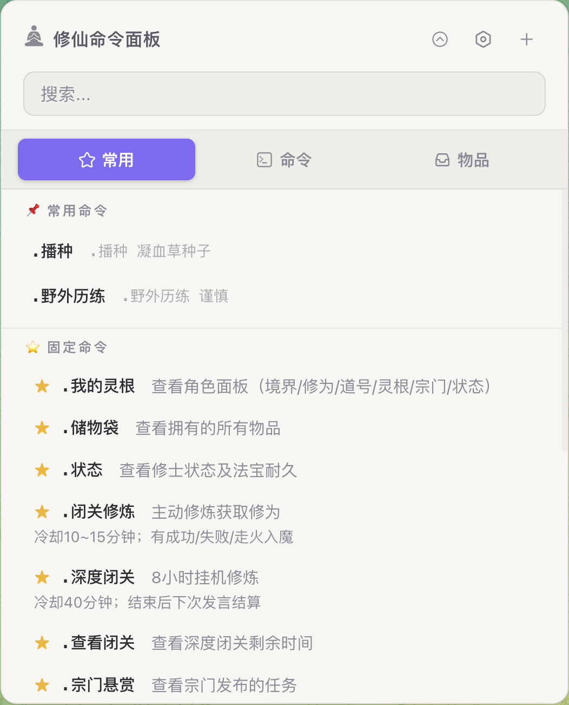
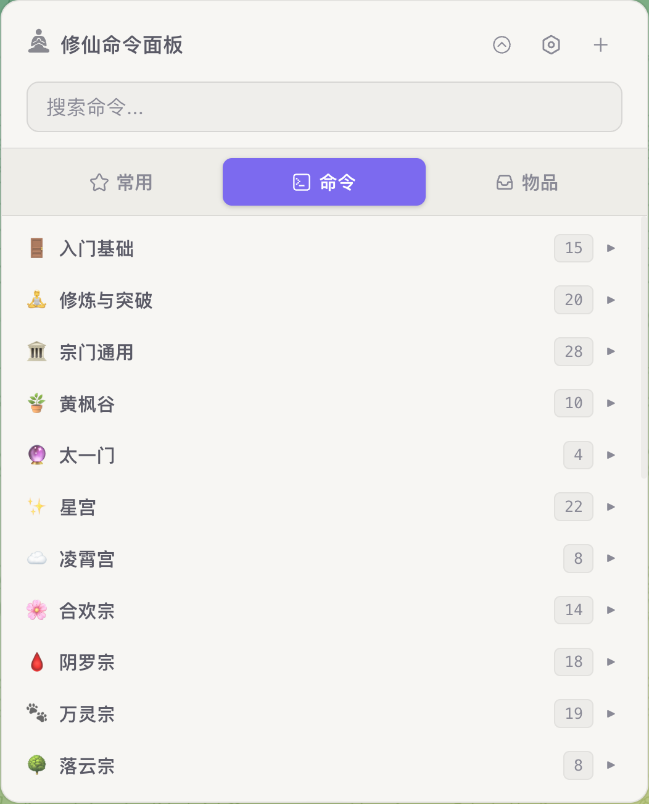
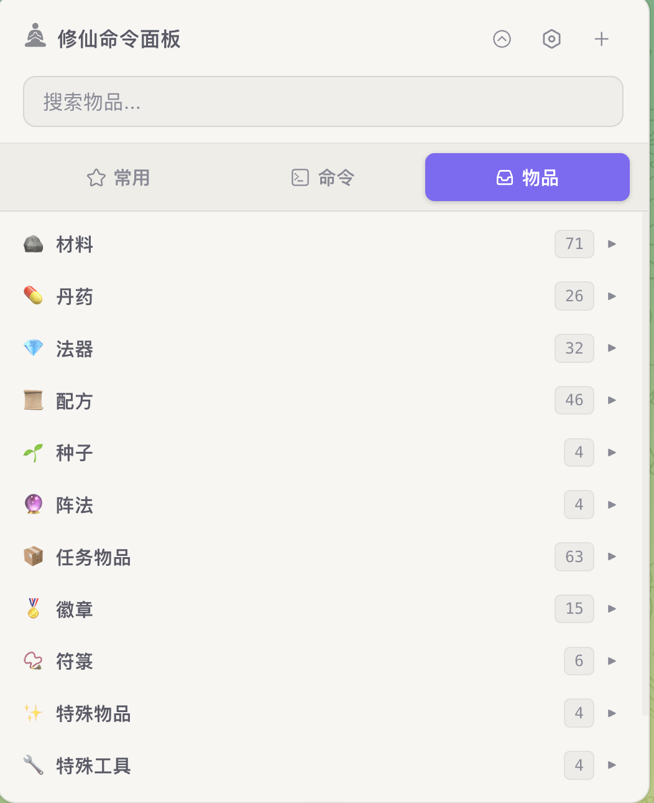

# 修仙命令面板

Telegram 修仙游戏 Bot 快捷命令面板 — Chrome 扩展，200+ 命令一键填入，支持搜索、收藏、自定义。

## 特性

- **200+ 命令**，覆盖修炼、战斗、炼丹、宗门等 25 个分类
- **参数模板**，带参数命令自动弹出表单，一键填入
- **收藏 / 最近使用 / 常用命令**，高频操作触手可及
- **物品图鉴**，浏览游戏内物品数据
- **搜索过滤**，命令和物品实时搜索
- **自定义命令**，内置编辑器，自由增删改
- **深色 / 浅色主题**，跟随系统或手动切换
- **Telegram Web 内嵌面板**，不离开聊天即可使用

## 截图

  

## 安装

### 方式一：下载压缩包（推荐）

1. 前往 [Releases](https://github.com/KFCSZYWJ/FanRenXiuXianTel/releases) 下载最新版本的 `FanRenXiuXianTel-v*.zip`
2. 解压到本地文件夹
3. 打开 Chrome，进入 `chrome://extensions/`
4. 开启右上角「开发者模式」
5. 点击「加载已解压的扩展」，选择解压后的文件夹
6. 打开 [Telegram Web](https://web.telegram.org/)，页面右下角出现 ⚡ 按钮即安装成功

### 方式二：克隆仓库

```bash
git clone https://github.com/KFCSZYWJ/FanRenXiuXianTel.git
```
然后按方式一的 3-6 步，选择克隆下来的文件夹。

> 目前仅支持 Telegram Web，移动端未适配。

## 使用

| 操作        | 说明 |
|-----------|------|
| 点击 悬浮框 按钮 | 打开/关闭命令面板 |
| 搜索框       | 实时搜索命令或物品 |
| 点击命令      | 命令文本自动填入输入框 |
| 带参数命令     | 自动弹出参数填写表单 |
| 收藏按钮 ☆    | 收藏命令到「固定命令」 |
| 最近使用      | 自动记录使用过的命令 |
| 设置        | 调整点击外部关闭、自动收起面板等行为 |

## 项目结构

```
├── manifest.json          # 扩展配置
├── content.js             # 主逻辑：面板渲染、事件绑定、SVG 图标
├── content.css            # 面板样式（含深色/浅色主题）
├── commands.js            # 命令数据（200+ 条，25 分类）
├── storage.js             # 存储管理：主题、最近、收藏、自定义命令
├── panel-ui.js            # 面板 UI 渲染：分类、搜索、收藏、最近
├── param-form.js          # 参数解析与参数表单弹窗
├── editor.js              # 自定义命令编辑器
├── autocomplete.js        # 命令自动补全
├── items.js               # 物品图鉴数据与渲染
├── data/
│   ├── items/all_items.json  # 物品数据
│   └── svg/                  # SVG 图标源文件
└── icons/                    # 扩展图标
```
